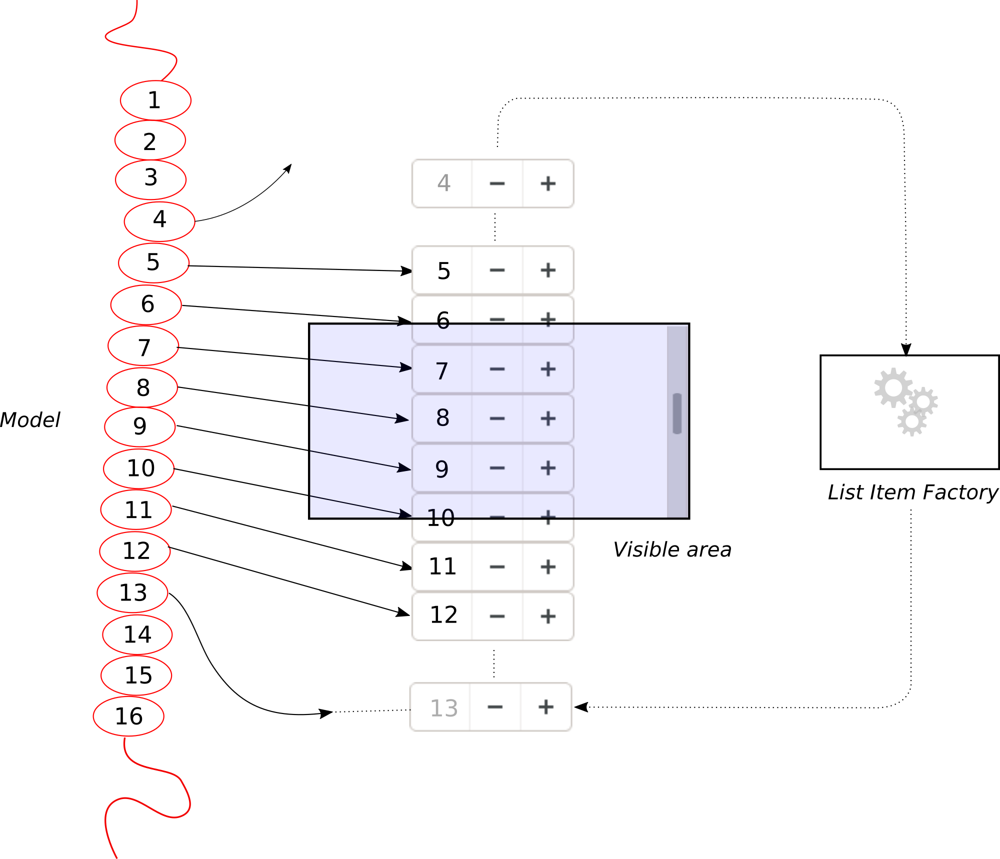
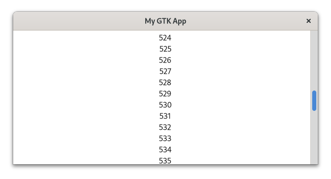

# Scalable Lists

In quite a few instances you have more elements than you can display at once.
Just think of the infinite amount of posts in your social media timeline.
Creating a widget for each individual post is impossible, but even for less extreme cases that is typically not what we want.
For that, we use scalable lists instead.
We give GTK our data and tell it how to transform this data into widgets.
GTK then reuses the widgets as we scroll through our elements.

Demonstrating this by creating a social media app is far beyond the scope of this book.
This is why, we will start with a long list of consecutive integers

<div style="text-align:center" width="20%"></div>

The model holds our data, but it also filters them and determines its order.
The main limitation here is, that [`gio::ListStore`](https://gtk-rs.org/docs/gio/struct.ListStore.html) only accepts GObjects.
We do not have to invest much time here, because we have nearly take over the `CustomButton` we created in the subclassing [chapter](gobject_subclassing.html).
The only difference is that it directly inherits from GObject instead of a Widget and the we added the method `from_integer`.

<span class="filename">Filename: listings/scalable_lists/1/integer_object/mod.rs</span>

```rust,no_run
{{#rustdoc_include ../listings/scalable_lists/1/integer_object/mod.rs:integer_object}}

# // Please ignore this line
# // It is only there to make mdbook happy
# fn main() {}
```

We start be filling our models with the first 1000 integers.

<span class="filename">Filename: listings/scalable_lists/1/main.rs</span>

```rust,no_run
{{#rustdoc_include ../listings/scalable_lists/1/main.rs:model}}
```

The `ListItemFactory` takes care of the widgets as well as their relationship to the model.
Here we use the [`SignalListItemFactory`](../docs/gtk4/struct.SignalListItemFactory.html) which emits a signal for every relevant step in the life of a `ListItem`.
We connect to the "setup" signal in order to create the widgets.
In our case, we are going for a `Label`.

<span class="filename">Filename: listings/scalable_lists/1/main.rs</span>

```rust,no_run
{{#rustdoc_include ../listings/scalable_lists/1/main.rs:factory_setup}}
```

In the "bind" step we bind the data in our model to the individual list items.

<span class="filename">Filename: listings/scalable_lists/1/main.rs</span>

```rust,no_run
{{#rustdoc_include ../listings/scalable_lists/1/main.rs:factory_bind}}
```

We then declare that we do not want our list items to be selectable by using [`NoSelection`](../docs/gtk4/struct.NoSelection.html).
Then we pass the model and the factory to the [`ListView`](../git/docs/gtk4/struct.ListView.html).

<span class="filename">Filename: listings/scalable_lists/1/main.rs</span>

```rust,no_run
{{#rustdoc_include ../listings/scalable_lists/1/main.rs:selection_list}}
```

Every `ListView` has to be inside a [`ScrolledWindow`](../docs/gtk/struct.ScrolledWindow.html) so we are adding it to one.

<span class="filename">Filename: listings/scalable_lists/1/main.rs</span>

```rust,no_run
{{#rustdoc_include ../listings/scalable_lists/1/main.rs:scrolled_window}}
```

<div style="text-align:center" width="20%"></div>
